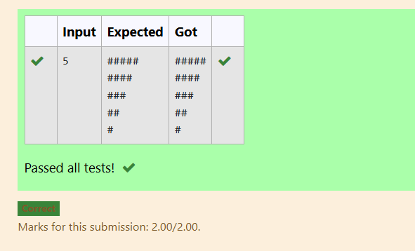
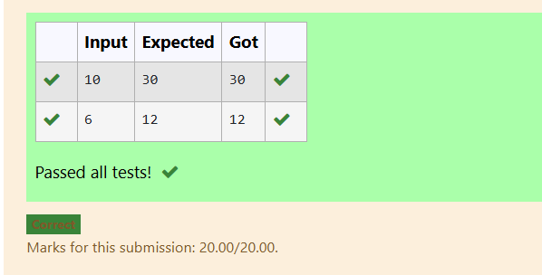
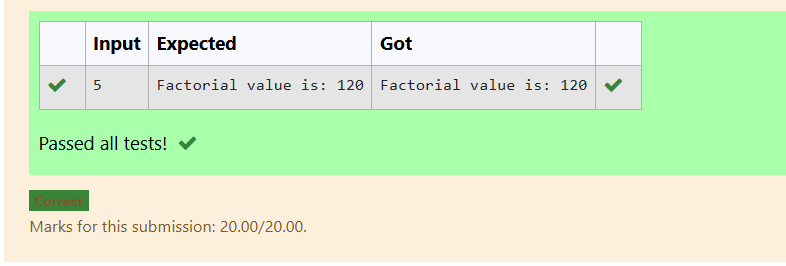

# EX-06 - Looping
## AIM:
Write a C program to print even numbers ranging from M to N (including M and N values).

## ALGORITHM:
1.	Declare two integer variables to store the values of M and N.
2.	Use the printf function to prompt the user to enter the values of M and N.
3.	Use the scanf function to read the values of M and N from the user.
4.	Use a loop (for or while) to iterate from M to N.
5.	Inside the loop, check if the current number is even.
6.	If the current number is even, print it.
7.	Continue the loop until you have iterated through all numbers from M to N.

## PROGRAM:
```
#include<stdio.h>
int main()
{
  int m,n,i;
  scanf("%d %d",&m,&n);
  for(i=n;i>=m;i--)
  {
    if(i%2==0){
        printf("%d ",i);
    }
  }
    return 0;
}
```
## OUTPUT:


## RESULT:
Thus the program to print even numbers ranging from M to N (including M and N values) has been executed successfully
 
 


# EX-07-Nested-loop

## AIM:

Write a C program to print the given triangular pattern using loop.

## ALGORITHM:

1.	Declare a variable to store the number of rows in the triangle.
2.	Use the printf function to prompt the user to enter the number of rows.
3.	Use a loop (for or while) to iterate through each row.
4.	Inside the loop, use another loop to print the desired number of asterisks for each row.
5.	Continue the loop until you have printed the entire triangular pattern.

## PROGRAM:
```
#include<stdio.h>
int main()
{
    int i,j,n;
    scanf("%d",&n);
    for(i=n;i>=1;i--){
        for(j=1;j<=i;j++){
            printf("#");
        }
        printf("\n");
    }
    return 0;
}

```

## OUTPUT:


## RESULT:

Thus the program to print the given triangular pattern using loop has been executed successfully
 
# EX-08-Functions

## AIM:

Write a C program to perform addition and subtraction of two numbers using functions (without argument and without return type).

## ALGORITHM:

1.	Declare two functions, one for addition and one for subtraction.
2.	Inside the addition & subtraction function, add & subtract the two numbers and print the result.
3.	In the main function,read their values from the user.
4.	Call the addition and subtraction functions, passing the two numbers as arguments.

## PROGRAM:
```
#include<stdio.h>
void add(){
    int sum,num1,num2;
    scanf("%d\n%d",&num1,&num2);
    sum = num1+num2;
    printf("Addition: %d\n",sum);
}
void sub(){
    int diff,num1,num2;
    scanf("%d\n%d",&num1,&num2);
    diff = num1 - num2;
    printf("Subtraction: %d",diff);
}
int main(){
    add();
    sub();
    return 0;
}

```

## OUTPUT:


## RESULT:

Thus the program to perform addition and subtraction of two numbers using functions has been executed successfully
 
 


# EX-09-Use For Loop

## AIM:

Write a c program to find the sum of even digits using while loop 


## ALGORITHM:

1. Declare integer variables number, i, and sum_even_digits. Initialize i = 2 and sum_even_digits = 0.

2. Read the value of number from the user using scanf().

3. Repeat the following steps while i <= number:

4. Add i to sum_even_digits.

5. Increment i by 2 to move to the next even number.

6. Print the value of sum_even_digits.

## PROGRAM:
```
#include <stdio.h>

int main() {
    int number,i=2, sum_even_digits = 0;

    scanf("%d", &number);

    
    while (i<=number) {
        sum_even_digits += i; 
        i += 2;        
    
    
    }


    printf("%d\n", sum_even_digits);

    return 0; 
}
```

## OUTPUT:




## RESULT:

Thus the program to find the sum of even digits using while loop has been executed successfully.


# EX – 10 - Factorial of a Number Using a Function
## AIM:
Write a C program for finding the factorial of a given number using function without return type with arguments.

## ALGORITHM:

1. Declare the variables i, fact, and n. Initialize fact = 1.

2. Read the value of n from the user using scanf().

3. Repeat the following steps for i = 1 to n:

4. Multiply fact by i and store the result back in fact.

5. Print the factorial value using printf().

## PROGRAM:
```
#include<stdio.h>
#include<math.h>
void fact();
int main(){
    fact();
    return 0;
}
void fact(){
    int i,fact=1,n;
    scanf("%d",&n);
    for(i=1;i<=n;i++){
        fact=fact*i;
    }
    printf("Factorial value is: %d",fact);
}

```

## OUTPUT:

## RESULT:
Thus, the program to find the factorial of a given number has been executed successfully. 
